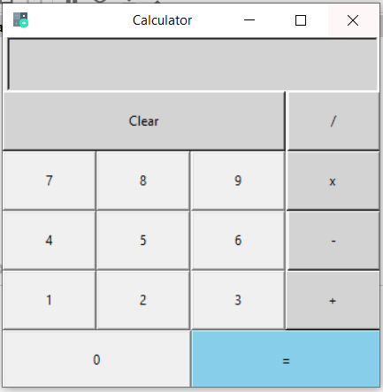

# Calculator

The Calculator was developed through the help of python application using tkinter module.

###Tools Used
    - Python
    - tkinter

How to download: Just simply clone the repo or download and extract the zip file inside your pycharm project folder.

Sample of Calculator

Name:Mohan Basnet

Student Id : 210003

Email: mbasnet201819@gmail.com
